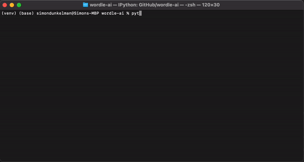

<h1 align='center'>Wordle AI</h1>

Several bots of increasing complexity that play the popular word guessing game Wordle.

You can also use it to play the game in Terminal offline.



I became interested in this project after learning that some players use a specific starting word (such as _irate_) in a strategic way to use vowels and common consonants. I then began to wonder what strategic first word is the best after optimising using AI.

## Table Of Contents

* [Installation](#Installation)
* [Usage](#Usage)
* [Models](#Models)
* [Roadmap](#Roadmap)

## <a name="Installation"></a>Installation

```
git clone https://github.com/SJDunkelman/wordle-ai.git
cd wordle-ai
virtualenv venv
source venv/bin/activate
pip install -r requirements.txt
```

## <a name="Usage"></a>Usage

For manual usage use the <code>-m</code> flag, to use the naive bot use the <code>-b</code> flag, such as:

```bash
python main.py -b
```

Flags:

| Flag | Usage                                          |
| ---: | ---------------------------------------------- |
|   -b | Simulate play with bot                         |
|   -m | Play manually                                  |
|   -n | Select how many rounds to play                 |
|   -v | Run verbose (print more statements about play) |


## <a name="Models"></a>Models
### Naive
The first model built mimics how a human plays by simply picking words randomly and then filtering the remaining available words based on the hints given. It currently achieves a reasonable accuracy, with a win percentage of 83.4% over 10,000 games with each game taking on average 4 rounds out of 6 to complete.


### DQM
[The following deep learning section is yet to be completed, please see [roadmap](#Roadmap)]

Whilst Wordle may at first look like an overly simple use for deep learning, the problem is analogous to the [multi-armed bandit](https://en.wikipedia.org/wiki/Multi-armed_bandit), whereby the user must allocate a fixed limited set of resources (letters) between competing choices (placement in word) in a way that maximises expected gain (minimum number of attempts). Our ideal model should balance _exploration_, as we attempt to guess the new word, and _exploitation_, where we learn strategic heuristics such as what word to start with.

## <a name="Roadmap"></a>Roadmap

* ~~Wordle Game Environment~~
* ~~Naive Bot~~
* ~~CLI interface~~
* Naive bot using conditional probabilities instead of random selection
* Markov Decision process bot
